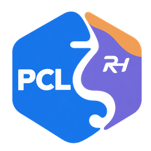

# PCL RH



基于 Rust 的 Minecraft: Java Edition 启动器，当前提供 Linux 原生实现，采用 **Rust + Tauri 2 + React / TypeScript**，参考 PCL CE 的界面布局与交互理念。无需 .NET。启动器核心使用 Rust，实验功能使用本地 Node.js / Python 引擎。本项目独立开发，非 PCL CE 官方发行。

RH 中的 R 代表 Rust，H 来自维护者的 GitHub 名称；RH 也呼应黎曼猜想（Riemann Hypothesis）。

## 功能

- Minecraft 原版版本目录、搜索、自定义实例名称，以及 Fabric、Forge、NeoForge 自动安装。
- 最多 4 项并行下载、同目录任务队列、逐项取消与未完成文件清理，完整文件缓存复用及 SHA-1 校验。
- 模组加载器安装包目录，以及 Modrinth 模组、整合包、数据包、资源包和光影包搜索、版本详情与依赖浏览。
- Modrinth 模组、资源包和光影安装，必要依赖规划、SHA-512 校验和相同内容复用。
- 本地 Modrinth 模组正式版更新、前置替换确认、禁用状态保留与更新撤销。
- Modrinth 版本文件独立另存、命名格式和本次会话的保存目录复用。
- 社区资源收藏夹与文件夹管理，已识别本地 Mod 的批量收藏，以及资源信息 JSON 导出。
- 游戏版本扫描、搜索、选择与实例设置。
- 实例描述、内置图标、列表分类与收藏管理，以及可恢复的物理实例重命名。
- 已有实例的组件重置、核心备份与中断恢复；按内容选择导出和导入本地 ZIP，并保存导出配置。
- Modrinth 社区整合包直接安装：官方 `.mrpack` 下载与校验，实例名、组件和可选内容确认，同名实例保护。
- 本地 ZIP / mrpack 整合包识别与安装：PCL 导出、Modrinth、HMCL、MCBBS、MultiMC / Prism、完整游戏目录和单层带启动器归档；自定义实例名称、可选文件与中断恢复。
- 实例删除移入可恢复区域，保留实例资料，并支持恢复原目录。
- 本地模组单个／批量启禁，模组、资源包与光影包导入，以及可撤销的删除。
- 多游戏目录登记、切换、排序与显示名称管理，使用系统文件夹选择器。
- Mojang 官方 Java 运行时下载、校验与任务取消，Java 自动匹配、手动添加与全局／单实例选择，以及全局和单实例内存设置。
- 版本继承、依赖库与 Linux 原生库解析。
- 游戏进程管理、退出状态与日志查看。
- PCL CE 风格导航、账号侧栏、实例修改／导出、资源详情及任务管理界面。
- 启动器外观、媒体、功能隐藏、简体中文／English、设置备份与本地诊断。
- **实验性功能**：数据型插件、Fabric 模组制作器与有限的模组迁移工具，统一使用启动器界面。[使用与限制](docs/EXPERIMENTAL.md)。
- 共享下载并发与速度限制、代理与 DoH、日志导出清理及应用入口恢复。
- 项目发行检查、校验下载、便携更新与回退，以及独立游戏监控。
- 可分别开启 Minecraft 正式版与快照更新提醒，按官方发布时间判断新版本并保存已读记录。
- 工具箱自定义 URL 下载、成就图片预览与保存、本地皮肤头像 PNG 生成。

项目仍在开发中，目前支持游戏与上述加载器安装、已有游戏启动、本地资源管理、Modrinth 资源安装与模组更新。本地整合包格式及限制见[使用指南](docs/USAGE.md#导入本地整合包)。仅含模组编号的 CurseForge 包暂不能自动补齐；OptiFine、LabyMod 自动安装尚未提供；部分早期版本暂不支持自动安装。Microsoft 正版登录暂未开放，服务接入由项目维护者完成。

## 构建与运行

需要 Rust/Cargo、Node.js 22.19+ / npm、Python 3.11+、GTK 3、WebKitGTK 4.1 及相关开发依赖。

```sh
git clone https://github.com/HyacineFengJin/PCL-RH.git
cd PCL-RH
./build-native.sh
./start-native.sh
```

首次使用时，在「启动 → 实例选择」中添加已有的游戏文件夹，然后从「下载」安装原版，或选择目录中已有的版本。支持管理多个目录，各目录分别记住所选实例、内存和 Java 覆盖设置。Java 默认按版本要求自动选择，也可在「设置 → Java」指定。详细步骤见[使用指南](docs/USAGE.md)。安装桌面应用入口需提供 `desktop-file-validate` 命令：

```sh
./install-desktop.sh
```

## 开发

阅读和维护代码可从[代码结构与排查入口](docs/DEVELOPMENT.md)开始。

- `apps/desktop/`：React 界面和 Tauri 桌面宿主。
- `crates/core/`：版本、依赖和启动核心。
- `crates/install/`：官方版本目录、文件下载、校验和安装。
- `crates/auth/`：Microsoft 认证和系统密钥环。
- `crates/network/`：代理、DoH 与共享下载策略。
- `crates/cli/`：命令行入口。

```sh
cargo test --workspace --locked --features pcl-desktop/custom-protocol
npm run preview:data --prefix apps/desktop
npm run dev --prefix apps/desktop
```

浏览器预览展示界面；启动游戏等桌面功能通过 Tauri 调用 Rust。Tauri 开发模式可在 `apps/desktop` 中运行 `npm run tauri -- dev`。

## 文档

- [使用指南](docs/USAGE.md)
- [账号与登录](docs/AUTHENTICATION.md)
- [CLI 使用](crates/cli/README.md)

## English

PCL RH is a Rust-based launcher for Minecraft: Java Edition, currently available for Linux and built with Rust, Tauri 2, React, and TypeScript. It installs vanilla, Fabric, and modern Forge/NeoForge versions with custom instance names, launches existing game installations, and displays game logs. Mojang Java runtimes can be downloaded and verified from Settings. Java can be selected automatically or registered manually, with global and per-instance choices. Tasks support cancellation and incomplete-file cleanup.

Local management includes multiple game directories, instance display preferences, physical renaming with reference migration and recovery, mod toggling, resource imports, and recoverable removal. Supported existing instances can reset their loader components with core backups and interruption recovery, or export selected content to a local ZIP. The launcher can import its own local ZIP exports under a custom name and restore recoverably deleted instances.

Local ZIP/mrpack import detects PCL exports, Modrinth, HMCL, MCBBS, MultiMC/Prism and complete game directories. Single-layer launcher archives are also recognized, including the exact HMCL bundled-package layout. Supported packs install under a custom instance name with optional-file choices, checked downloads and recoverable publication. CurseForge manifests are recognized, but packs requiring remote CurseForge file IDs cannot yet be completed automatically; custom launch commands and unsupported loader layouts are reported before installation.

Modrinth mods, resource packs and shaders can be installed with required dependencies, SHA-512 verification and exact-content reuse. Local Modrinth mods support compatible release updates, required-dependency planning, disabled-state preservation and recoverable replacement with persistent undo. Modrinth modpacks can also be downloaded directly from version details, reviewed with a custom instance name and optional-file choices, and installed as new instances. Some legacy layouts and OptiFine/LabyMod installation are not yet available.

Microsoft sign-in is not yet available. The project maintainers are responsible for completing the service integration.

Experimental tools are available from Tools: declarative extensions, a Fabric source-project maker and limited mod migration patches. They share a local Pi engine. Live AI uses saved provider presets with editable budgets and has not been tested online; generated source is not automatically built. See [experimental features](docs/EXPERIMENTAL.md).

## 致谢

项目图标及主要美术由 GPT 制作。Project icons and primary artwork are created with GPT.

界面理念参考 [PCL CE](https://github.com/PCL-Community/PCL-CE)，认证流程参考 [HMCL](https://github.com/HMCL-dev/HMCL)。Linux 平台与服务分层参考 [PCL N Edition](https://github.com/PCL-N-Edition/PCL-N)。界面和 Rust 认证代码独立编写。
